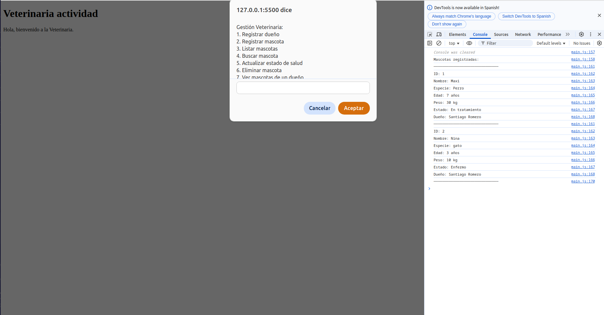

# 🐾 Gestión Asíncrona de una Veterinaria

Este proyecto es una simulación de un sistema de gestión para una veterinaria, desarrollado con JavaScript puro. Permite registrar dueños y mascotas, actualizar su estado de salud, buscar, listar y eliminar mascotas, y todo ello haciendo uso de asincronía mediante **callbacks**, **promesas** y **async/await**.

---

## 🎯 Objetivo

Implementar un CRUD completo (Crear, Leer, Actualizar y Eliminar) para dueños y mascotas utilizando asincronía en JavaScript. El sistema se ejecuta desde consola y con `alert`, `prompt` y `confirm`, sin interfaz gráfica.

---

## 🚀 Funcionalidades

- Registrar dueños (nombre, cédula, teléfono y correo)
- Registrar mascotas (nombre, especie, edad, peso, estado de salud)
- Validar existencia del dueño antes de registrar una mascota
- Actualizar estado de salud de una mascota
- Eliminar mascota con confirmación
- Buscar mascota por nombre
- Ver todas las mascotas
- Ver todas las mascotas de un dueño
- Simulación de asincronía con `setTimeout`, `Promesas` y `async/await`

---

## 🧵 Aplicación de la Asincronía

Este proyecto aplica asincronía para simular demoras reales en la gestión de información. Se utilizaron diferentes métodos:

- **Callbacks**: en funciones como `registrarDueño` y `registrarMascota` para continuar el flujo una vez finaliza un proceso simulado con `setTimeout`.
- **Promesas**: usadas en funciones como `buscarMascota` y `eliminarMascota`, donde se espera una respuesta después de un retardo artificial.
- **async/await**: implementado en funciones como `listarMascotas`, `actualizarEstadoSalud` y `verMascotasDeDueño` para escribir código asíncrono de forma más legible.

Esto permite comprender cómo trabajar con datos en operaciones que podrían tardar, como en una aplicación real con una base de datos o un servidor remoto.

---

## 🛠️ Tecnologías

- Lenguaje: **JavaScript** 
- HTML
- Métodos de entrada/salida: `prompt`, `alert`, `confirm`, `console.log`
- Entorno: **Navegador Web**

---

## 📂 Estructura del Proyecto

📁 veterinaria/
│
├── index.html
├── main.js
└── README.md

> ⚠️ Este proyecto se ejecuta desde un archivo HTML básico que carga `script.js`. No usa HTML visual, solo para habilitar la ejecución del JS en navegador.

---

## ▶️ ¿Cómo ejecutar?

1. Clona este repositorio o descarga los archivos.
2. Abre el archivo `index.html` en tu navegador.
3. El menú interactivo se mostrará mediante prompts y alerts.
4. Visualiza los resultados detallados por consola (usa F12 > Consola).

---

## 📸 Vista de ejemplo

---

## 📌 Consideraciones

- No se permite registrar mascotas si el dueño no existe.
- No se permiten cédulas duplicadas al registrar un dueño.
- Los estados de salud válidos son: `Sano`, `Enfermo`, `En tratamiento`.
- Todas las operaciones con demora se simulan con `setTimeout` para demostrar asincronía.
- No requiere conexión a internet ni instalación adicional.

---

## 🧠 Aprendizajes

- Implementación práctica de asincronía en JavaScript
- Uso de `setTimeout`, `Promise`, `async/await`
- Validaciones y estructura de un CRUD completo
- Manejo de flujo de datos entre arreglos relacionados (dueños y mascotas)

---

## 👨‍💻 Autor

- Nombre: Santiago Romero 
- Taller academico

---

